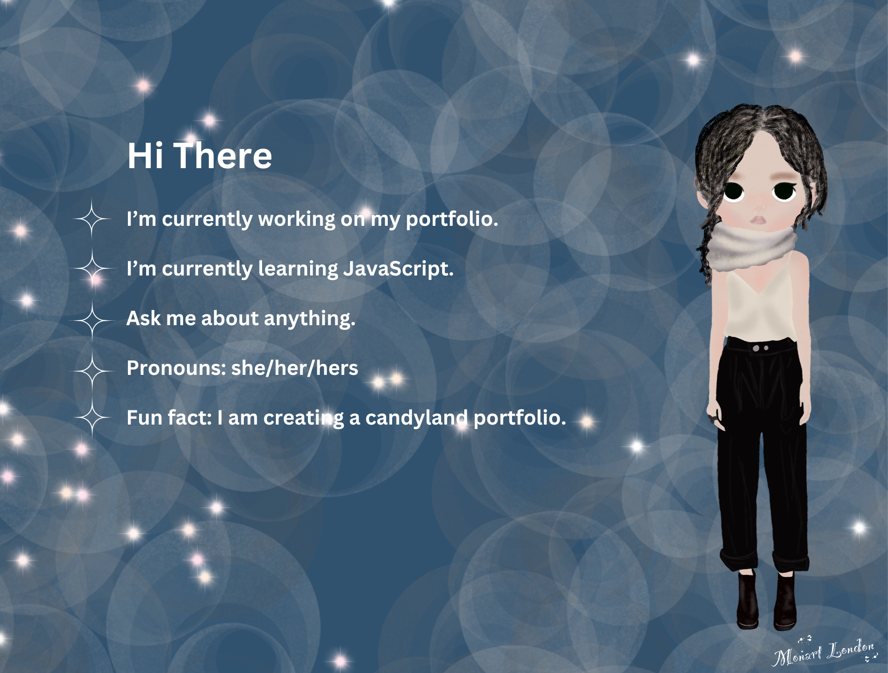

<!-- All the icons are from: https://github.com/devicons/devicon/tree/master/icons 

 
-->

 

## Hi there 👋

- 🔭 I’m currently working on my portfolio.
- 🌱 I’m currently learning JavaScript.
- 💬 Ask me about anything.
- 😄 Pronouns: she/her/hers
- ⚡ Fun fact: I am creating a candyland portfolio. 

 

### Languages:

  

### Tools:

<!--

-->

